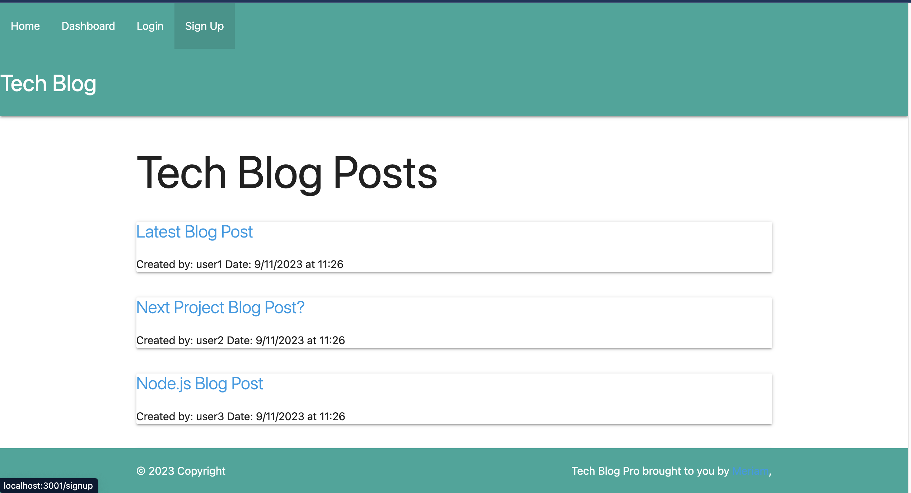
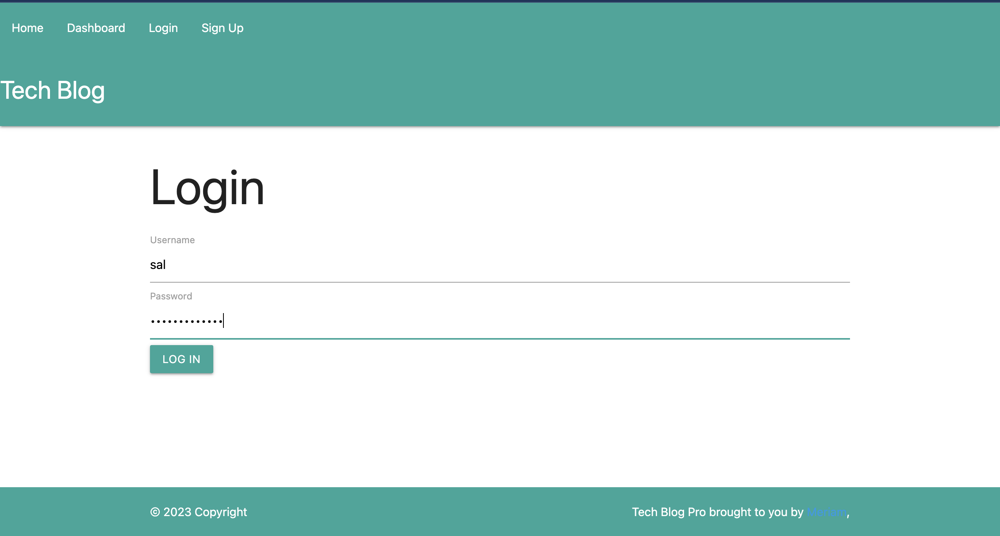
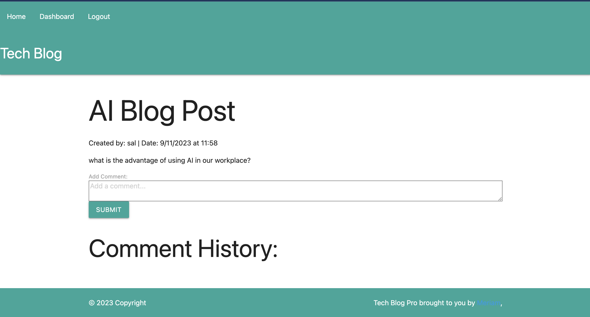
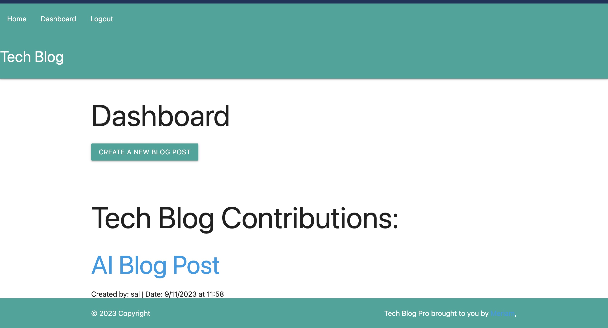

# Tech Blog

## Description

This is a CMS-style blog site similar to a Wordpress site, where developers can publish their blog posts and comment on other developers’ posts as well. You’ll build this site completely from scratch and deploy it to Heroku. This app will follow the MVC paradigm in its architectural structure, using Handlebars.js as the templating language, Sequelize as the ORM, and the express-session npm package for authentication.

## GitHub Repo URL
https://github.com/msadio8/Tech-Blog

## Website URL on Heroku

https://tech-blogmvc-6b76500c3c3a.herokuapp.com/

## Table of Contents
* [GitHub Repo URL](#github-repo-url)
* [Website URL on Heroku](#website-url-on-heroku)
* [Technologies Used](#technologies-used)
* [Main Page](#main-page)
* [Login Page](#login-page)
* [Dashboard Page](#dashboard-page)
* [CreateBlog Page](#createblog-page)

## Technologies Used
The Activity Tracker website is built using the following technologies:

1. Boot Camp Materials - Module 14: Model-View-Controller (MVC)
2. Prior Knowledge and experience
3. [dotenv][def1] Documentation
4. [mysql2][def2] Documentation
5. [Sequelize v6][def3] Documentation
6. [Express HandleBars][def4] Documentation
7. [Materialize][def5] Documentation
8. [bcrypt][def6] Documentation
9. [express-session][def7] Documentation
10. [connect-session-sequelize][def8] Documentation
    
[def1]: https://www.npmjs.com/package/dotenv
[def2]: https://www.npmjs.com/package/mysql2
[def3]: https://www.npmjs.com/package/sequelize
[def4]: https://www.npmjs.com/package/express-handlebars
[def5]: https://materializecss.com/
[def6]: https://www.npmjs.com/package/bcrypt
[def7]: https://www.npmjs.com/package/express-session
[def8]: https://www.npmjs.com/package/connect-session-sequelize

## Mock-Up

The following images shows the web application's appearance and functionality:

## Main Page

## Login Page

## Dashboard Page

## CreateBlog Page
